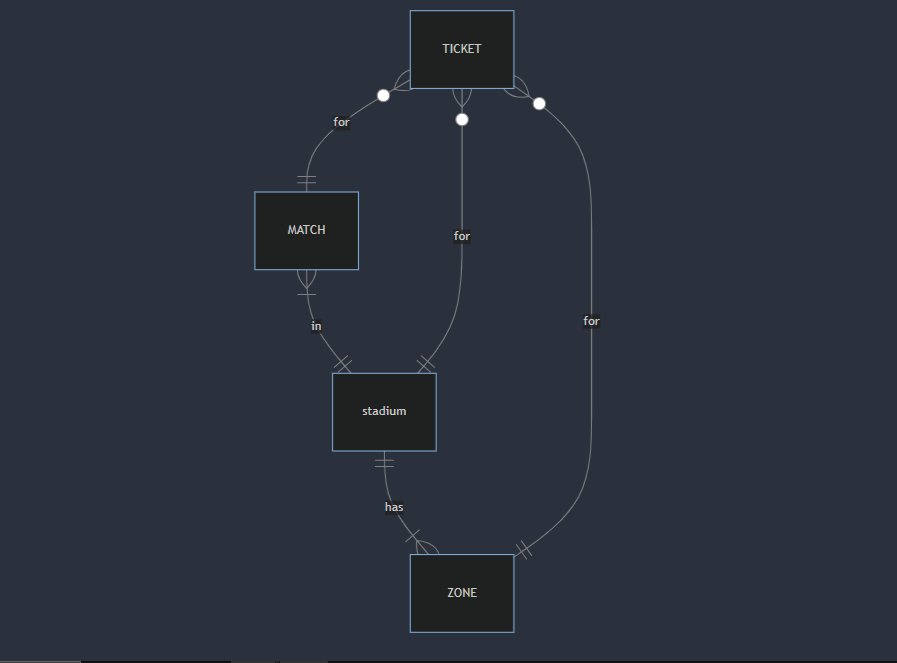

# Design Document

By Aymen elrrouji

Video overview: <URL  https://youtu.be/uIOw6W0JDHA>

## Scope

In this section you should answer the following questions:

* What is the purpose of your database?
my database is for ticketing system where users can get their own unique tikcets to attend football matches , included in the database's scope is:

* stadiums including their capacity , their zones and their names
* matches including their date, teams and  stadium
* tickets including price , stadium , zone , is they been used and   using time
Out of scope are elements users, players, teams , match ,results
## Functional Requirements

This database will support:

* CRUD operations on all tables
* get a ticket for some match
* search for upcoming matches
* see how many tickets are left
* search favorite team next match
* What's beyond the scope of what a user should be able to do with your database?
- see match results , see players that played in that match
## Representation
Entities are captured in SQLite tables with the following schema.
### Entities

The database includes the following entities:

#### tickets
* `id`, which specifies the unique ID for the ticket as an `INTEGER`. This column thus has the `PRIMARY KEY` constraint applied.
* `zone_id` which is id for the zone that ticket is for as an `INTEGER`.  This column thus has the `FOREIGN KEY` constraint applied, referencing the `id` column in the `zones` table to ensure data integrity.
* `match_id` which is id for the match that ticket is for as an `INTEGER`.  This column thus has the `FOREIGN KEY` constraint applied, referencing the `id` column in the `matches` table to ensure data integrity.
* `stadium_id` which is id for the stadium that match is in as an `INTEGER`.  This column thus has the `FOREIGN KEY` constraint applied, referencing the `id` column in the `stadiums` table to ensure data integrity.
* `price` which is the price of the ticket as an `INTEGER`
* `used` takes two values 0 and 1 ,0 means that the ticket has not been used yet ,and 1 means that the ticket  is already used
* `use_time` which specifies when the ticket was used. Timestamps in SQLite can be conveniently stored as `NUMERIC`, per SQLite documentation at <https://www.sqlite.org/datatype3.html>.

#### matches
* `id` which specifies the unique ID for the ticket as an `INTEGER`. This column thus has the `PRIMARY KEY` constraint applied.
* `home_team` the team who hosts the match ,as `TEXT` to reprenste team name
* `away_team` the other team in the match ,as `TEXT` to reprenste team name
* `match_date` which specifies the date of the match .Timestamps in SQLite can be conveniently stored as `NUMERIC`, per SQLite documentation at <https://www.sqlite.org/datatype3.html>
* `stadium_id` which is id for the stadium that match is in as an `INTEGER`.  This column thus has the `FOREIGN KEY` constraint applied, referencing the `id` column in the `stadiums` table to ensure data integrity.
* `type` which is the type of the match like a "friendly match" or a "league match" as `TEXT`
* `ended` as `INTEGER` to represent if the selling of the tickets ended , 1 means it ended and 0 means not ended
#### stadiums
* `id` which specifies the unique ID for the ticket as an `INTEGER`. This column thus has the `PRIMARY KEY` constraint applied.
* `name` the name of the stadium AS `TEXT`
* `capacity` of the stadium as `INTEGER`
* `city` where the stadium is located as `TEXT`
#### zones
* `id` `id` which specifies the unique ID for the ticket as an `INTEGER`. This column thus has the `PRIMARY KEY` constraint applied.
* `name` of the zone for exaple zone 1 , zone 2 ..... as `TEXT`
* `capacity` which is the capcity of that zone how many people can fit in it , as `INTEGER`
* `stadium_id` which is id for the stadium that the zone is in as an `INTEGER`.  This column thus has the `FOREIGN KEY` constraint applied, referencing the `id` column in the `stadiums` table to ensure data integrity.
* `price` of the zone's ticket , as `integer`
### Relationships

In this section you should include your entity relationship diagram and describe the relationships between the entities in your database.

## Optimizations

Per the typical queries in `queries.sql`, it is common for users of the database to search matches of their favorite team For that reason, indexes are created on the `away_team`, `home_team`. and it is also
common for them to search matches by date for example weekend matches
that's way index is created on `match_date` column to speed the identification of matches by those columns.

## Limitations

to stop tickets selling databes user would have to manualy change the value of the `ended` colomn to 1
the tickets dont have password
